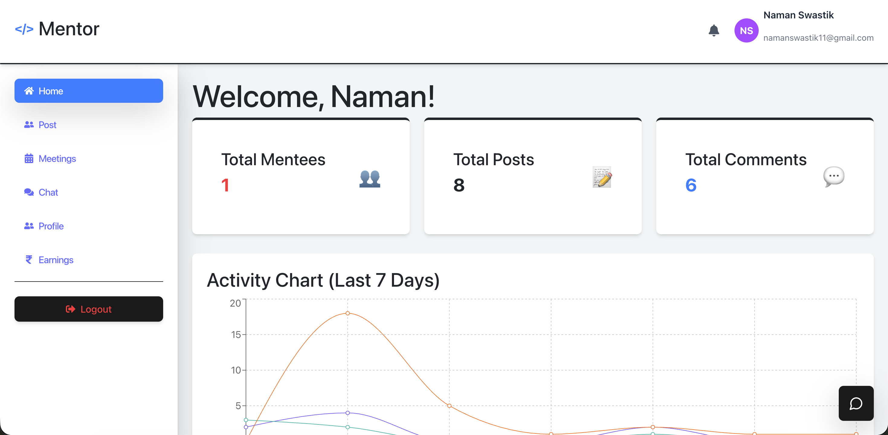
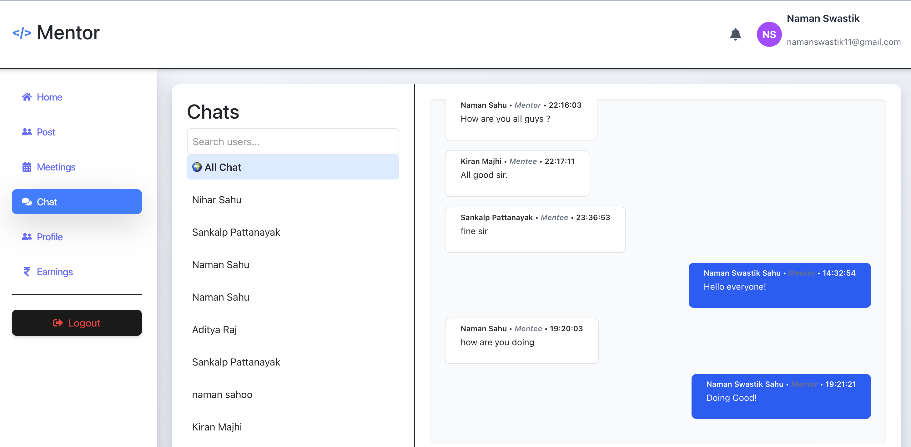

<div align="center">


#  MentorConnect  
### *A Modern Student–Mentor Platform built with React + Firebase*

<br/>

[]()
[]()
[]()
[]()

</div>

---

##  Overview

MentorConnect is a simple and effective mentoring platform designed for universities, communities, and skill-based programs.  
It allows mentors and mentees to communicate, chat, track meetings, share posts, and manage their learning journey — all in one place.

The project focuses on:
- 🔥 Clean UI  
- ⚡ Real-time updates  
- 🔐 Secure Firebase authentication  
- 💬 Fast 1-to-1 chat  
- 📊 Dashboard analytics  

---

##  Screenshots  
*(Replace paths with actual images later)*

| Home | Dashboard | Chat |
|------|-----------|-------|
|  |  |  |

---

## 🛠️ Tech Stack

### Frontend
- React + Vite  
- TailwindCSS  
- React Router  
- React Toastify  

### Backend / Infra
- Firebase Authentication  
- Firestore Database  
- Firebase Storage  
- Firebase Hosting (optional)

---

## 🚀 Getting Started

### 1️⃣ Clone the repository
```sh
git clone https://github.com/YOUR-USERNAME/MentorConnect.git
cd MentorConnect
2️⃣ Install dependencies
npm install

3️⃣ Firebase Setup

Create src/firebase.js:

import { initializeApp } from "firebase/app";
import { getAuth } from "firebase/auth";
import { getFirestore } from "firebase/firestore";
import { getStorage } from "firebase/storage";

const firebaseConfig = {
  apiKey: "",
  authDomain: "",
  projectId: "",
  storageBucket: "",
  messagingSenderId: "",
  appId: ""
};

const app = initializeApp(firebaseConfig);

export const auth = getAuth(app);
export const db = getFirestore(app);
export const storage = getStorage(app);


Enable in Firebase Console:

Email/Password Auth

Firestore

Storage

▶️ Run the project
npm run dev


Open:

http://localhost:5173

✨ Features

✔ Role-based login (Mentor / Mentee)

✔ Real-time 1-to-1 chat

✔ Post creation + image uploads

✔ Comments system using Firestore subcollections

✔ Dynamic dashboard analytics

✔ Meeting tracking (upcoming vs completed)

✔ Firebase-driven user profiles

📁 Folder Structure
src/
│── pages/
│── components/
│── firebase.js
│── App.jsx
│── main.jsx
│── index.css
│── App.css

🏗 Build for production
npm run build

🌐 Deploy to Firebase Hosting
npm install -g firebase-tools
firebase login
firebase init
firebase deploy

🤝 Contributing
Feel free to fork the repo, open issues, or submit pull requests.

👤 Author
Naman Swastik Sahu

